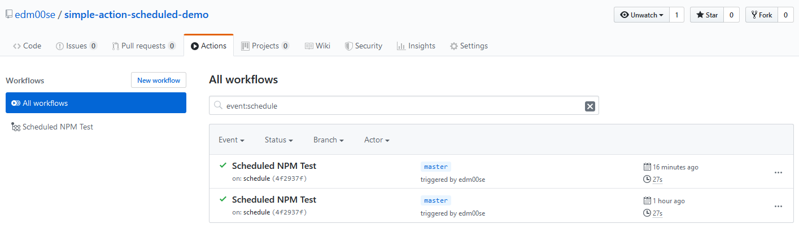

# Simple Action Scheduled Demo

A simple, and somewhat contrived, demo showing the use of GitHub Actions on a schedule. 

## The Moving Parts

This is defined in the GitHub Action yaml file and is specified to run on `schedule`, as opposed to `push` or `pull_request`. This is further contrived in that npm executes the default `test` script, with its output of `Error: no test specified`.

## Usage

If you're wondering why to use a scheduled action, there are some use cases for scheduled testing. This would likely not have anything to do with unit tests, but with integration tests or a generic browser test involving production site uptime, etc. This is not an ideal form of testing, but could be a stop gap under certain use cases.

## Example

You can see the scheduled executions under [the Actions tab, filtering on `event:schedule`](https://github.com/edm00se/simple-action-scheduled-demo/actions?query=event%3Aschedule).

## References

- [GitHub Actions docs](https://help.github.com/en/actions)
- [GitHub Actions docs on triggering events, permalink to scheduled events](https://help.github.com/en/actions/automating-your-workflow-with-github-actions/events-that-trigger-workflows#scheduled-events-schedule)
- [corntab](https://corntab.com/), great for computing "crontab" schedule values

## License

MIT
